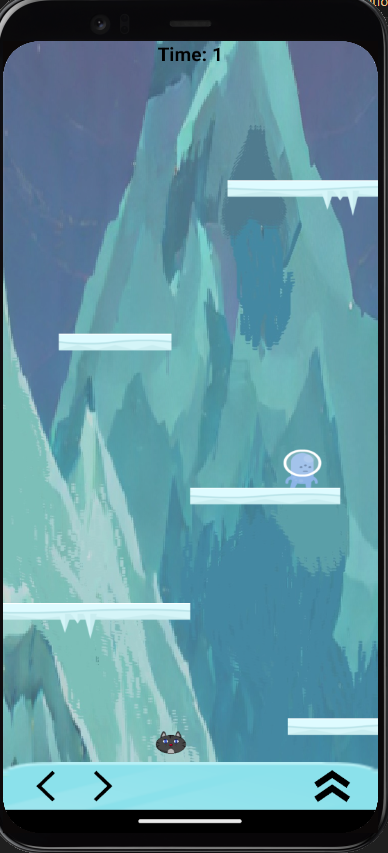

## Nome

<h1 align="center">Pixel Jumper</h1>

## Descrição

Um jogo de plataforma desenvolvido em React Native, usando as Engines do [Matter-js](https://brm.io/matter-js/) e a [react-native-game-engine](https://www.npmjs.com/package/react-native-game-engine) para o trabalho final da matéria DS151 Desenvolvimento Para Dispositivos Móveis do curso de Tecnologia em Análise e Desenvolvimento de Sistemas da Universidade Federal do Paraná

É um jogo simples que contém 3 fases, a ideia é que o personagem principal começa em uma floresta, e vai subindo uma montanha para chegar no topo dela. O jogo utiliza física para fazer o personagem principal pular em plataformas, ao chegar ao final de um estágio o botão de pulo abre um evento que leva o jogador ao próximo nível. O segundo nível contém 1 obstáculo com detecção de colisão que manda um sinal por meio de um [dispatch]() que engatilha um evento que leva o jogador a tela de game-over, o terceiro nível contém 2 obstáculos estáticos (Espinhos) e 1 obstáculo móvel - que a lógica de movimentação não foi implementada ainda - com o mesmo evento que leva o jogador ao game-over.

## Layout das Telas




## Gifs do Jogo

<h2 align="center">Exemplo de uma Full Run:

</h2>
<h2 align="center">Exemplo de colisão:

</h2>
<h2 align="center">Exemplo de colisão:

</h2>
<h2 align="center">Exemplo de colisão:

</h2>

## Instalação

Faça o Clone do repositório e
Execute as linhas de comando:

```
npm install
npx expo start

```

# EXECUTE O PROGRAMA USANDO UM EMULADOR DE ANDROID OU UM CELULAR, O PROGRAMA NÃO RODA EM WEB.

## Autor
Thalyson [GitHub](https://github.com/nooneknowws)
